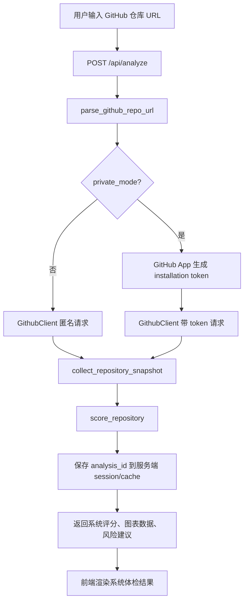

# 实现设计细节

## 1. 产品定位

本项目是一个本地 Web 工具，用来快速判断 GitHub 仓库的健康状态。它不是 CI 服务，也不是自动化治理机器人；第一职责是读取仓库公开或已授权的只读数据，生成可解释的健康评分和建议。

核心设计取舍：

- 系统评分先出结果，保证无需模型也能完成体检。
- AI Agent 单独触发，避免模型失败影响基础体检。
- 公开仓库匿名可用，降低使用门槛。
- 私有仓库只走 GitHub App，不使用个人 token。
- 所有 GitHub App 权限只读，避免误操作用户仓库。

## 2. 模块划分

```text
app/config.py
  读取 .env，形成 Settings。

app/routes.py
  Web 页面和 JSON API 路由。

app/github/url_parser.py
  校验并解析 github.com 仓库 URL。

app/github/client.py
  GitHub REST API client。公开仓库匿名请求，私有仓库使用 installation token。

app/github/app_auth.py
  GitHub App JWT、installation 状态读取、installation access token 生成。

app/analyzer/collector.py
  调 GitHub API 收集系统评分所需快照。

app/analyzer/scoring.py
  确定性评分、风险和建议。

app/agent/tools.py
  给 Agent 使用的受控 GitHub API 包装工具。

app/agent/tavily.py
  Tavily search/extract 包装。

app/agent/llm.py
  OpenAI-compatible Chat Completions client 和 provider 错误包装。

app/agent/service.py
  Agent 编排：收集工具上下文、构造 prompt、调用模型、归一化输出。

templates/index.html
static/css/styles.css
static/js/app.js
  单页前端：输入、授权状态、系统评分、图表、Agent 分析结果。
```

## 3. 系统体检数据流



`analysis_id` 是 Agent 分析的入口凭证。`/api/agent/analyze` 不信任客户端重新提交的 URL、系统评分或基础信息，而是从服务端缓存中读取已经完成的系统体检结果。

## 4. GitHub API 数据采集

系统体检使用以下数据：

| 数据 | GitHub API | 用途 |
| --- | --- | --- |
| 仓库基础信息 | `/repos/{owner}/{repo}` | 名称、描述、stars、forks、issues、license、默认分支、更新时间。 |
| 语言分布 | `/repos/{owner}/{repo}/languages` | 语言占比图和代码组成评分。 |
| 社区健康 | `/repos/{owner}/{repo}/community/profile` | README、License、贡献指南、安全策略、模板等。 |
| 提交列表 | `/repos/{owner}/{repo}/commits` | 近 30/90 天提交数量和最近提交样本。 |
| 贡献者 | `/repos/{owner}/{repo}/contributors` | 项目成熟度和维护者规模参考。 |
| Releases | `/repos/{owner}/{repo}/releases` | 发布节奏、最新版本时间。 |
| Pull requests | `/repos/{owner}/{repo}/pulls` | Open PR 积压。 |

采集器对部分非核心接口使用降级策略：某个辅助接口失败时记录 `partial_errors`，不阻断整体评分。

## 5. 系统评分

系统评分由 `app/analyzer/scoring.py` 计算，总分 100。

| 维度 | 权重 | 规则摘要 |
| --- | ---: | --- |
| 活跃维护 | 30% | 近 30/90 天提交、最近 push、最近 release。 |
| 社区规范 | 25% | README、License、CONTRIBUTING、行为准则、安全策略、Issue/PR 模板。 |
| 协作健康 | 15% | Open issues、Open PRs、贡献者数量。 |
| 项目成熟度 | 15% | Stars、Forks、贡献者、Release。 |
| 代码组成 | 10% | 是否有可识别语言分布，多语言仓库给满分，单语言给 85。 |
| 风险扣分 | 最多 -5 | 每个风险扣 2 分，最多扣 5 分。 |

状态等级：

| 分数 | 状态 |
| ---: | --- |
| 85-100 | 优秀 |
| 70-84 | 良好 |
| 55-69 | 一般 |
| 40-54 | 风险 |
| 0-39 | 高风险 |

关键风险：

- `archived`：仓库已归档。
- `disabled`：仓库已禁用。
- `missing_license`：缺少许可证。
- `missing_readme`：缺少 README。
- `inactive`：近 90 天无提交。
- `no_recent_commits`：近 30 天无提交。
- `issue_backlog`：Open issues 数量过高。
- `pull_request_backlog`：Open PRs 数量过高。
- `partial_data`：部分 GitHub 数据获取失败。

`archived`、`disabled`、`inactive` 会触发关键风险上限，最终分数最高不超过 54。

## 6. GitHub App 私有仓库设计

私有仓库访问流程：

1. `.env` 配置 GitHub App ID、slug、私钥路径和 setup URL。
2. 用户点击 `/github-app/install`，跳转 GitHub App 安装页。
3. GitHub 安装完成后回调 `/github-app/setup?installation_id=...`。
4. 后端用 App JWT 读取 installation 状态，只把非敏感状态放入 session。
5. 分析私有仓库时，后端为当前仓库生成短期 installation access token。
6. token 仅用于当前请求，不写入 `.env`，不返回前端。

基础私有体检权限：

```python
{
    "contents": "read",
    "metadata": "read",
    "pull_requests": "read",
}
```

Agent 增强权限按 installation 已授权权限动态请求，只请求 read 级别。未授权工具返回 `available: false` 或记录 tool error，不阻断其他工具。

## 7. Agent 设计

Agent 分析由 `POST /api/agent/analyze` 单独触发。

### 7.1 输入

Agent 不接受客户端提交的仓库事实作为可信输入，只接受：

```json
{
  "analysis_id": "系统体检返回的 ID",
  "confirm_private_data_to_model": true
}
```

后端根据 `analysis_id` 从服务端缓存读取：

- 仓库 URL。
- private/public 模式。
- 系统评分。
- GitHub 基础探测结果。

### 7.2 工具集合

基础 GitHub 工具：

- `github.get_repo_summary`
- `github.get_language_breakdown`
- `github.get_community_profile`
- `github.get_recent_commits`
- `github.get_issues_summary`
- `github.get_pulls_summary`
- `github.get_releases`
- `github.get_actions_runs_summary`
- `github.get_readme_and_key_files`

私有仓库增强工具：

- `github.get_traffic_summary`
- `github.get_sbom_summary`
- `github.get_dependabot_alerts_summary`
- `github.get_code_scanning_alerts_summary`
- `github.get_secret_scanning_alerts_summary`
- `github.get_checks_summary`
- `github.get_repository_rules_summary`
- `github.get_security_advisories_summary`
- `github.get_deployments_summary`

公开仓库可额外使用：

- `tavily.search`
- `tavily.extract`

私有仓库默认禁用 Tavily，避免把私有仓库数据发送给公开搜索或网页提取工具。

### 7.3 Prompt 约束

Prompt 要求模型：

- 只输出严格 JSON。
- 使用中文分析。
- `ai_score` 为 0-100 分。
- `confidence` 只能是 `high`、`medium`、`low`。
- `findings[]` 必须包含 `level`、`title`、`message`。
- `references[]` 必须包含 `title`、`url`、`evidence`。
- 只能引用输入中实际存在的 GitHub/Tavily 证据。
- 私有模式不得建议使用 Tavily 或公开网页证据。

### 7.4 输出归一化

`app/agent/service.py` 会把模型输出归一化为：

```json
{
  "ai_score": 86,
  "agent_score": 86,
  "confidence": "high",
  "summary": "...",
  "findings": [],
  "recommendations": [],
  "references": [],
  "used_tools": [],
  "attempted_tools": [],
  "tool_errors": [],
  "tavily_enabled": true
}
```

如果模型输出不是有效 JSON，后端返回低置信度 fallback，不影响系统体检结果。

## 8. LLM provider 错误处理

`app/agent/llm.py` 使用 OpenAI-compatible Chat Completions API。

处理策略：

- 优先使用 `response_format={"type": "json_object"}`。
- 如果 provider 不支持 `response_format`，自动移除该参数重试。
- Provider 状态错误统一包装为 `LlmProviderError`，返回结构化 502。
- 只有安全白名单错误码如 `model_not_found` 会把 provider message 返回给前端，并先做 token/API key 脱敏。
- 未知认证错误、网关错误或可能包含敏感信息的 provider message 不直接返回前端。
- 本地 SDK 使用错误导致的无关 `TypeError` 不包装，方便开发期暴露真实问题。

## 9. 前端设计

页面不是营销页，首屏就是工具。

布局：

- 顶部：标题和 GitHub App 状态。
- 工作台：仓库 URL 输入、公开/私有模式、GitHub App 授权状态。
- 系统摘要：系统评分、仓库名称、描述、模式和错误数量。
- 指标区：Stars、Forks、Issues、Watchers、License、默认分支等。
- 图表区：语言分布、评分维度。
- 明细区：社区与活动、风险与建议。
- Agent 区：横跨结果区全宽，避免长文本挤在窄栏中。

Agent 结果渲染：

- 评分摘要作为左侧重点卡。
- 发现项使用 `level` 徽标、标题和说明分层展示。
- 建议和引用独立分区。
- 引用链接仅允许 `http:`/`https:`，使用 DOM API 和 `textContent`，不使用 `innerHTML`。
- `target="_blank"` 搭配 `rel="noreferrer"`。

## 10. 安全边界

- 不支持静态 `GITHUB_TOKEN`。
- Installation token 不返回前端、不写入 `.env`、不长期存储。
- GitHub App 权限只读。
- 私有仓库默认禁用 Tavily。
- 私有仓库数据发给模型前需要用户显式确认。
- Agent 工具固定端点、固定分页、字段白名单和摘要化输出。
- Secret scanning、code scanning、Dependabot 等安全数据只返回摘要，不返回 secret、完整漏洞上下文或大段私有内容。
- 前端不使用 `innerHTML`、`insertAdjacentHTML` 或 `eval` 渲染模型内容。

## 11. 运行和验证建议

开发时建议至少执行：

```powershell
python -m pytest -q -p no:cacheprovider --basetemp tmp\pytest_tmp
node --check static\js\app.js
python -m pip check
```

手工验证：

1. 启动 `python run.py`。
2. 打开 `http://127.0.0.1:5000`。
3. 分析公开仓库 `https://github.com/pallets/flask`。
4. 确认系统评分、图表、社区清单、风险建议和 Agent 区正常。
5. 如果 `.env` 配了模型和 Tavily，启动 Agent，确认 `used_tools` 包含 GitHub 工具，公开仓库可包含 Tavily 工具。
